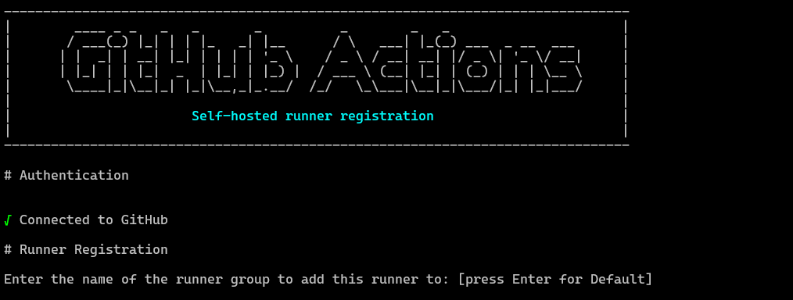
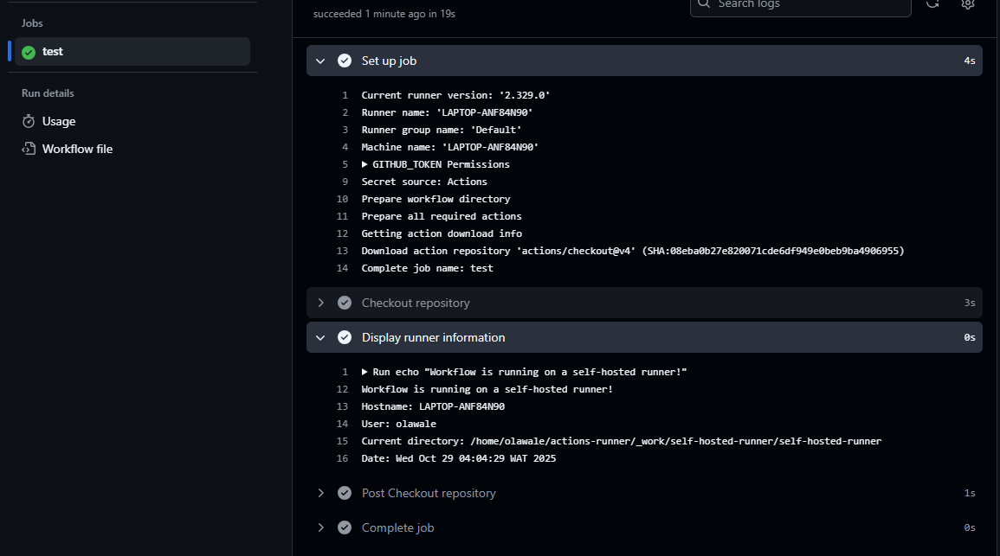
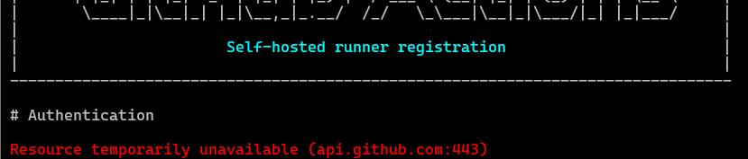

# Self-Hosted GitHub Actions Runner Setup

## Overview
This project demonstrates how to set up a **self-hosted GitHub Actions runner** on a local machine and execute a test pipeline. Self-hosted runners gives more control over the hardware, operating system, and software tools used CI/CD workflows.

---

## Prerequisites

- A GitHub account with repository access
- A Linux machine (physical or virtual)
- `curl` and `tar` utilities installed
- Stable internet connection
- Administrator/sudo access

---

## Steps to Reproduce

### 1. Create a GitHub Repository

Create a new repository on GitHub named `self-hosted-runner`.

### 2. Register the Self-Hosted Runner

Navigate to the repository on GitHub:

1. Go to **Settings** → **Actions** → **Runners**
2. Click **New self-hosted runner**
3. Select operating system ( **Linux**)
4. Select architecture ( **x64**)

### 3. Download and Configure the Runner

Run the following commands on the local machine:

```bash
# Create a directory for the runner
mkdir actions-runner && cd actions-runner

# Download the latest runner package
curl -o actions-runner-linux-x64-2.329.0.tar.gz -L https://github.com/actions/runner/releases/download/v2.329.0/actions-runner-linux-x64-2.329.0.tar.gz

# Optional: Validate the hash
echo "194f1e1e4bd02f80b7e9633fc546084d8d4e19f3928a324d512ea53430102e1d  actions-runner-linux-x64-2.329.0.tar.gz" | shasum -a 256 -c

# Extract the installer
tar xzf ./actions-runner-linux-x64-2.329.0.tar.gz

# Configure the runner (follow the prompts)
./config.sh --url https://github.com/YOUR_USERNAME/YOUR_REPO --token YOUR_TOKEN

# Start the runner
./run.sh
```

> **Note:** Replace `YOUR_USERNAME`, `YOUR_REPO`, and `YOUR_TOKEN` (token is generated automatically) with your actual values from the GitHub runner setup page.


### 4. Verify Connection

After successful registration, connected to github with show up:

```
✓ Connected to GitHub
Runner listening for jobs

```




Runner is now active and waiting for workflow jobs.

### 5. Create a Workflow File

Create the following file structure in your repository:

```
self-hosted-runner/
├── .github/
│   └── workflows/
│       └── pipeline.yml
└── README.md
```

Example workflow file (`.github/workflows/pipeline.yml`):


### 6. Push and Test

Commit and push your changes to trigger the workflow:

```bash
git add .
git commit -m "Add test workflow for self-hosted runner"
git push origin main
```

### Navigate to the **Actions** tab in the GitHub repository to see the workflow executing on local machine.
---




## Challenges & Solutions

### Challenge 1: Runner Failed to Connect Due to Firewall
**Solution:** Opened necessary ports and whitelisted GitHub's IP ranges in the firewall settings.



### Challenge 2: Workflow Stuck in "Waiting for Runner"
**Solution:** Ensured the runner was active by running `./run.sh` and verified the runner appeared as "Idle" in the GitHub repository settings.


---

## Security Considerations

**Important Security Notes:**

- The runner token is should never be commit it to version control.
- Regularly remove inactive runners from your repository settings.
- Use runner labels to isolate different environments (e.g., `dev-runner`).
- Keep your system and runner software updated to patch security vulnerabilities.

---

## Production Best Practices

These are the recommendation for improvement, if deploying self-hosted runners in a production environment

| Aspect | Recommendation |
|--------|----------------|
| Isolation | Run runners inside Docker containers or dedicated VMs to prevent cross-contamination |
| Scaling | Implement autoscaling with multiple runners to handle parallel jobs |
| Monitoring | Add logging and monitoring solutions to track runner health and job execution |
| Maintenance | Automate runner updates and implement cleanup procedures for old versions |
| Ephemeral Runners | Use ephemeral runners that are destroyed after each job for better security |


## Repository Link

[GitHub Repository](https://github.com/Olamiwale/self-hosted-runner.git)